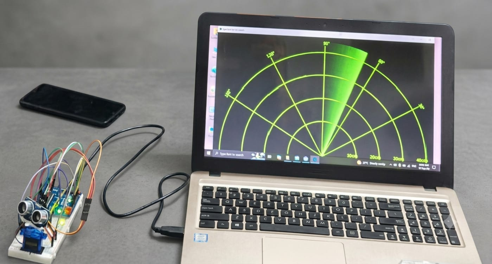

# Radar-Based Object Detection & Security System

A real-time, interactive radar system built using hardware-software interfacing. The project uses an **Arduino Uno** to control physical sensors and a **Processing IDE** custom interface to visually map out obstacles in a 180-degree sweep area. 

This project also functions as an automated security system, triggering visual and audible alerts using LEDs and a Buzzer when an object enters the critical safety zone.

---

## 🛠️ Hardware Components Used
* **Arduino Uno** (Main Microcontroller)
* **Ultrasonic Sensor (HC-SR04)** (For distance measurement)
* **Servo Motor (SG90)** (For rotating the sensor from 0° to 180°)
* **Buzzer** (For audible alarm alerts)
* **LEDs (Red/Green)** (For visual status indicators)
* **Breadboard & Jumper Wires** (For circuit connections)

---

## 📌 Pin Configuration (Arduino Uno)

### 1. Ultrasonic Sensor (HC-SR04)
* **VCC** ➡️ Arduino 5V (+ve)
* **Trig** ➡️ Arduino Digital Pin 10
* **Echo** ➡️ Arduino Digital Pin 11
* **GND** ➡️ Arduino GND (-ve)

### 2. Output Alert System
* **Buzzer & Red LED** ➡️ Configured as outputs to trigger when an object is detected within the danger zone.

---

## 🚀 Key Features & Working Logic
* **180° Automated Scan:** The servo motor continuously sweeps the ultrasonic sensor back and forth to monitor the surrounding area.
* **Real-time Mapping UI:** Captures angular and distance data from the sensor and renders it dynamically as a classic green radar sweep in Processing IDE.
* **Smart Security Alert (20cm - 30cm Range):** * **Safe Zone:** The path is clear, and the system monitors normally (Green LED stays ON).
  * **Danger Zone:** If an object/obstacle comes within **20cm to 30cm**, the **Red LED blinks** and the **Buzzer sounds an alarm** immediately.

---

## 💻 Software & Technologies
* **Arduino IDE** (Embedded C/C++ for hardware programming)
* **Processing IDE** (Java-based graphics programming for the Radar UI)

---

## 📂 Project Structure
* `Arduino_Code/` - Contains the `.ino` sketch for sensor calibration, servo control, and alert logic.
* `Processing_Code/` - Contains the `.pde` sketch to render the graphical radar interface on the screen.

---

## 🔧 How to Setup and Run
1. **Circuit Assembly:** Connect all hardware components as per the Pin Configuration section.
2. **Upload Hardware Code:** Open the file inside `Arduino_Code/` via Arduino IDE, select your correct COM Port, and upload it to the Arduino Uno.
3. **Launch Radar Visualizer:** Open the file inside `Processing_Code/` via Processing IDE. Ensure the serial port matches your Arduino's COM port, and press **Run**.
